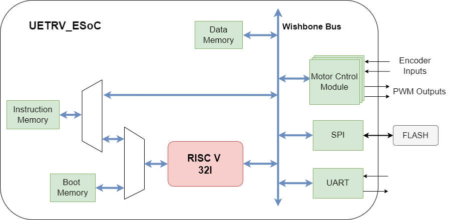

## UETRV_ESoC  
UETRV_ESoC is a RISC-V based Embedded class SoC integrating 3-stage pipelined core with multiple peripherals for embedded applications. Currently, the core implements RV32I ISA based on User-level ISA Version 2.0 and Privileged Architecture Version 1.11 supporting machine mode only. The core does not have any structural hazards, while data hazards are resolved using forwarding and stalling. Following is the status of current implementation:

- Machine level interrupts has been added, including the support for vectored interrupts.
- External interrupts are supported using bits 16 and above of MIP & MIE CSRs as provisioned by Privileged Architecture Version 1.11. 
- Data hazards are resolved using forwarding, while Load-Use hazard leads to one cycle stall. 
- Memory and peripherals are integrated through Wishbone Interconnect.
- The SoC has on-chip pre-initialized boot memory with a simple boot loader. 
- The system boots from external flash using SPI interface.
- Three motor control modules, capable of controlling dc-servo motors with encoder feedback, have been integrated for coordinated multi-axis motion control.  

### Update
UETRV_ESoC has been updated to version 2 i.e. UETRV_ESoC_v2 with some bugfixes, by Muhammad Usama Zubair. Please see the repository [UETRV_ESoC_v2](https://github.com/ee-uet/UETRV_ESoC_v2) for a description of the updates, as well as back-end design, for submission to Skywater Open MPW-8.

### SoC Block Diagram


### SoC Memory Map
The memory map of SOC is shown in the following table:

| Base Address        |    Description            |   Attributes    |
|:-------------------:|:-------------------------:|:---------------:|
| 0x0000_0000         |      Instruction Memory   |      R-X-W      |
| 0x0000_1000         |      Data Memory          |      R-W        |
| 0x0000_2000         |      UART                 |      R-W        |
| 0x0000_3000         |      SPI                  |      R-W        |
| 0x0000_4000         |      Motor Control 1      |      R-W        |
| 0x0000_5000         |      Motor Control 2      |      R-W        |
| 0x0000_6000         |      Motor Control 3      |      R-W        |
| 0x0000_7000         |      Boot Memory          |      R-X        |

- `R: Read access`
- `W: Write access`
- `X: Execute access`

The pictorial representation of memory map is in the following picture:


The `linker.ld` file has the memory definition as follows:
```
MEMORY
{ 
  FLASH_INST (rx) : ORIGIN = 0x00000000, LENGTH = 2K
  FLASH_BOOT (rx) : ORIGIN = 0x00007000, LENGTH = 1K
  RAM       (rwx) : ORIGIN = 0x00001000, LENGTH = 2K
}
```
### Generating Verilog
Different building blocks for the SoC are integrated using the top module [`'src/main/scala/SoC_Tile.scala'`](src/main/scala/SoC_Tile.scala). To generate the Verilog, Scala Build Tool (sbt) and its dependencies needs to be installed. The verilog code can be generated by executing the following command:

`> sbt run`


### Building the Application Executable
Out of reset, the _Boot Memory_ is invoked by the core and the processor starts executing the instructions that are hard coded into the _Boot memory_. As a result of this execution, the Application program is loaded from the external _SPI FLASH Memory_ into the _Instruction Memory_. This phenomenon is demonstrated using the following diagram:

 

### Project Demo (Simulation and FPGA)
Two application [example programs](/examples) are provided for demo purpose. A simple demo program prints hello using the uart interface (`'.\examples\uart'`). The second program demonstrates the working of the motor module and is also illustrated using the demo video. Assuming the compilation tools are available, executing the `'make.bat'` generates `'imem.c'`, which is used by the SPI flash programmer to write the flash. The demo video below further explains the working of the project. 


[](https://www.youtube.com/watch?v=nsFyD8QpKSA)

The project demo includes an FPGA based implementation to control a DC motor with encoder feedback. The demo project illustrating the motor control configuration is available [here](/examples/motor_servo). The FPGA based implementation is available [here](/fpga/).

### The Bootloader 
A simple bootloader for SPI flash is implemented and has been integrated in the SoC using preinitialized boot memory (`'.\src\main\scala\memory\bmem.scala'`). The bootloader source code and further details are available [here](/bootloader).

### SPI Flash Programming 
A custom SPI flash memory progammer, using TI's TivaC embedded board is also developed and is available in a separate [repo](https://github.com/ee-uet/Flash_Programmer).  


